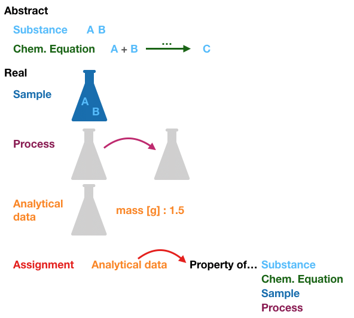

## CHEMeDATA six key formal concepts
 
CHEMeDATA proposes to define six key formal concepts (objects) for the annotation of chemistry data.

*(The html links are not active yet... see the bottom part of this page for more details.)*

 - 1 [***Substance***](./substance)   
 - 2 [***Chem. Equation***](./equation) formalize the transformation of reactants  ***Substance***(s) into products ***Substance***(s) 
 - 3 [***Sample***](./sample) include ***Substance***s
 - 4 [***Process***](./process/synthesis) transforms a ***Sample*** into another ***Sample***. Reaction, extraction, purification, *etc.* are ***Process***'s.
 - 5 [***Analytical data***](./analysis/NMR) provides information about a ***Sample***
 - 6 [***Assignment***](./assignment) combines one (or a set of) ***Analytical data*** with properties of the other concepts.



[Comments and suggestions are welcome!](https://github.com/CHEMeDATA/ontologies/issues/new)

*The following is a draft*

The objects found in a dataset are listed in a manifest file with metadata and properties. A selection of objects and key metadata and properties can be registered with the DOI of the data set using the datacite "subject" field to make them "Findable".
  
  * ***Substance*** [](./substance)  
    * Formula (XnYm)
    * properties
      * atom list
      * connection table (+ bond types?)
      * INCHI
      * 2D [](./substance)  
      * 3D structure(s) (may have multiple conformations/mesomers) [](./substance)
      * *etc.*
    * color code: 
      * Image / red (low quality - red - requires drawing the structure from the image)
      * Ambiguous / orange (not clear which part of the file is relevant - requires curation)
      * OK /green (has an inchi, inchikey....)
  * ***Sample*** [](./sample)
    * Types:
      * (s) Solution sample : Simple solution with a single pure solvent
      * (m) Solution sample in a mixture of solvents: Mixture of solvents
      * (w) Water solution : for water solution with buffer, salt, *etc.*
      * (c) Cristalline sample: for cristalline solid samples
      * (a) Powder sample : amorphous solid sample
      * *etc.*
    * properties
      * composition (***Substance***s, quantity)
      * *etc.*
    * color code: 
      * No description / red
      * OK / green

  * ***Chem Equation*** 
  [](./equation) formalize the transformation of reactants  ***Substance***(s) into products ***Substance***(s)
    * Specify the cathegory of the reaction? [](./equation) 
    * Properties
      * category (name...)
      * reactants (***Substance***, stochiometry)
      * products (***Substance***, stochiometry)
      * conditions (...)
      * Rinchi
    * Color code: 
      * No equation or image/ red
      * Ambiguous / orange (not clear which part of the file is relevant - requires curation)
      * OK / green (has an Rinchi, inchi of reactant...)
  * ***Process*** transforms a ***Sample*** into another ***Sample***
    * categories
      * [](./process/reaction) 
      * Chromoatography (HPLC, etc.)
      * *Purification?* (Recristallisation, etc.)
      * *Plant extraction?*
      * *etc.* to be worked on!
    * Properties
      * Category (name...)
      * Conditions
      * Initial ***Sample***
      * Final ***Sample***
      * ***Chem Equation*** (for reactions only)
  * ***Analysis*** provides information about a ***Sample***
    * Spectroscopy
      * NMR [](./analysis/NMR) [](./analysis/NMR) 
      * IR
      * Ms...
    * Non-spectroscopy
      * Melting point
      * *etc.*
    * Properties
      * ***Sample***
      * Temperature
    * color code: 
      * No mimimal property present / red
      * Missing essential property / red
      * image / orange-red
      * propriatary format / orange-red
      * (no green - not other categories otherwise becomes ***Assignment***)
  * ***Assignment*** combines one (or a set of) ***Analysis*** with one (or more) property of the other 5 object types 
    * NMR [](./assignment/NMR) [](./assignment/NMR) 
    * IR
    * Ms ? categories...
    * *etc.*
    * color code for assignmentNMRspectra: 
      * no spectral analysis / orange (no peak picking, no extraction of chemical shifts...)
      * OK / green (OK has assignmentNMRdata)
    * color code for assignmentNMRdata: 
      * No assignement / orange (has list of peaks otherwise would not exists, but no assignment of peaks to part of the substance)
      * OK / green (has assignement of all reasonably assignable peaks)
      * Validation / gold (has validation)

### Goal 1: Provide a linked-data consolidation of the CHEMeDATA format

Move from the NMR-only assignment format of the NMReDATA initiative (based on .sdf files) towards linked data. <a href="https://json-ld.org/" title="JSON-LD Data"></a>

### Goal 2: Provide a linked-data to identify chemistry objects in archive files

[work-in-progress owl file](chemedata/playground/chemedata.owl)
```
https://chemedata.github.io/ontologies/chemedata/playground/chemedata.owl
```
Exported [OWLDoc](chemedata/playground/index.html) can be found in the chemedata/playground folder.


